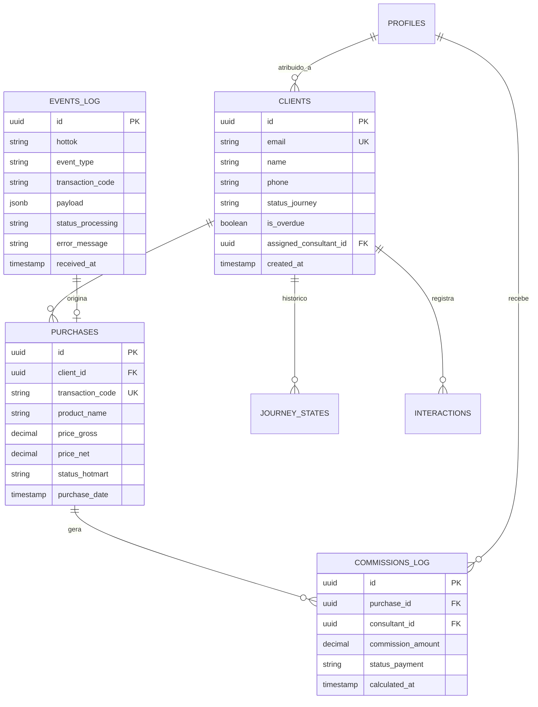

# ARCHITECTURE-SPINE: Canadá Sem Filtro | Central de Atendimento

## 0. Resumo Executivo & Paradigma

A Central de Atendimento será construída como uma aplicação web interna moderna baseada em **Next.js (App Router)** integrada ao **Supabase (PostgreSQL + Auth + RLS)**. 

A arquitetura prioriza a **integridade dos dados**, **rastreabilidade auditável** e **resiliência contra indisponibilidades externas**. A aplicação funciona como um Ledger de Eventos e Fila Operacional, onde webhooks da Hotmart são processados de forma idempotente, e o estado dos clientes é mantido em tempo real com controle rigoroso de acesso por linha (Row Level Security).

---

## 1. Invariantes Herdadas (do PRD)

- **[ADOPTED] Roles e Permissões:** Matriz de 4 papéis (`admin`, `consultant`, `marketing`, `tech`) com controle granular de acesso a PII e dados financeiros.
- **[ADOPTED] Regra dos 7 Dias:** Diagnóstico e agendamento Calendly bloqueados até 7 dias pós-compra.
- **[ADOPTED] Fallback Manual:** O sistema permite a continuidade operacional manual caso webhooks ou APIs falhem.
- **[ADOPTED] SLA em Horas Úteis:** Prazo de 24 horas calculado estritamente em dias e horários comerciais.
- **[ADOPTED] Gestão de Comissões Exclusiva do Admin:** Tabelas e porcentagens de comissão editáveis somente pelo perfil `admin`.

---

## 2. Decisões de Arquitetura (ADs)

### AD-1: Stack Tecnológico & Hospedagem
* **Binds:** Next.js (App Router / React Server Components), Supabase (PostgreSQL, Auth, RLS), Tailwind CSS + Lucide Icons.
* **Prevents:** Acoplamento com frameworks legados ou ORMs pesados; o acesso ao banco utiliza o cliente oficial `@supabase/supabase-js` com tipos gerados (`database.types.ts`).
* **Rule:** Todo endpoint de API e Server Action deve validar autenticação e autorização via token JWT do Supabase no servidor.

### AD-2: Webhooks Hotmart & Idempotência
* **Binds:** Endpoint `/api/webhooks/hotmart` com validação de assinatura `X-HOTMART-HOTTOK`.
* **Prevents:** Processamento duplicado de compras, estouro de concorrência ou perda silenciosa de payloads por instabilidade na rede.
* **Rule:** 
  1. O payload bruto do webhook é **sempre** gravado na tabela `events_log` com status `pending` antes de qualquer processamento de negócio.
  2. O processamento verifica a existência de `transaction_id` + `event_type` já processado. Se existir, o evento é marcado como `ignored_duplicate` e retorna HTTP 200.
  3. Caso haja erro, o status é alterado para `error` com o traceback registrado para reprocessamento manual pela role `tech`.

### AD-3: Modelo de Dados & Normalização
* **Binds:** Tabelas de domínio separadas em:
  - `profiles`: extensão da tabela `auth.users` com a role do usuário (`admin`, `consultant`, `marketing`, `tech`).
  - `clients`: cadastro único do cliente (identificado prioritariamente pelo e-mail principal).
  - `purchases`: histórico de transações vinculadas ao cliente e ao produto.
  - `journey_states`: histórico de mudanças de estado (`compra`, `diagnostico_enviado`, `acompanhamento`, `consulta_marcada`, `consulta_concluida`, `cancelamento`, `reembolso`).
  - `interactions`: registro de contatos reais (WhatsApp, e-mail, ligação).
  - `commissions_config` & `commissions_log`: regras configuráveis do admin e histórico de comissões por atendimento.
  - `events_log`: ledger imutável dos webhooks e integrações.

### AD-4: Segurança & Row Level Security (RLS)
* **Binds:** Políticas de RLS diretamente nas tabelas do PostgreSQL.
* **Prevents:** Vazamento de PII para usuários não autorizados ou alteração indevida por APIs manipuladas no front-end.
* **Rule:**
  - `admin`: Leitura e escrita irrestrita em todas as tabelas.
  - `consultant`: Leitura/escrita em `clients` e `interactions` onde é responsável ou atribuído na fila; leitura apenas das suas comissões em `commissions_log`.
  - `marketing`: Leitura restrita a views agregadas (sem e-mail completo, telefone ou endereço).
  - `tech`: Leitura e reprocessamento exclusivo da tabela `events_log`.

### AD-5: Motor de Cálculo de SLA em Horas Úteis
* **Binds:** Função utilitária no banco/servidor `calculate_business_hours(start_time, current_time, schedule_config)`.
* **Prevents:** Falsos alertas de estouro de SLA gerados durante fins de semana, feriados ou madrugadas.
* **Rule:** A contagem de 24 horas úteis é baseada na janela parametrizável (padrão: 09:00 às 18:00 de segunda a sexta). Clientes que ultrapassam o limite têm a flag `is_overdue = true` ativada e aparecem no topo da fila.

### AD-6: Deduplicação & Alertas de Conflito
* **Binds:** Função de conciliação no cadastro de clientes.
* **Prevents:** Sobrescrita silenciosa de dados quando o cliente altera e-mail ou compra sob nova oferta.
* **Rule:** Se o e-mail não existir mas houver correspondência exata em telefone/documento, o registro cria o cliente como `pending_review` e gera uma entrada em `duplicate_alerts` para decisão manual da `admin`.

### AD-7: Supabase Auth, Middleware SSR & Gestão de Sessão
* **Binds:** Autenticação nativa via **Supabase Auth** usando a biblioteca oficial `@supabase/ssr`, página de login dedicada (`/login`), cookies HTTP-only protegidos e `middleware.ts` do Next.js.
* **Prevents:** Acesso desprotegido a rotas internas; vazamento de credenciais; perda de contexto de sessão em navegação Server-Side (RSC).
* **Rule:**
  1. O `middleware.ts` valida a sessão do Supabase Auth para todas as rotas internas (`/`, `/clientes`, `/configuracoes`), redirecionando não autenticados para `/login`. Rotas públicas são restritas a `/login` e `/api/webhooks/hotmart`.
  2. A tabela `public.profiles` estende `auth.users` via trigger automático `on_auth_user_created()`, inicializando o perfil com a role correspondente (`admin`, `consultant`, `marketing`, `tech`).
  3. A Administradora gerencia os convites e permissões da equipe criando os usuários no Supabase Auth ou enviando Magic Links / Senhas provisórias.

---

## 3. Diagrama do Modelo de Dados & Fluxos

---

## 4. Requisitos de Infraestrutura & Deploy

1. **Supabase Cloud / PostgreSQL:** Projeto configurado com extensões `pgcrypto` para UUIDs e triggers automáticos de `updated_at`.
2. **Vercel / Next.js Server Actions:** Hospedagem da aplicação web com rotas `/api` configuradas para runtime Node.js.
3. **Environment Variables Obrigatórias:**
   - `NEXT_PUBLIC_SUPABASE_URL`
   - `NEXT_PUBLIC_SUPABASE_ANON_KEY`
   - `SUPABASE_SERVICE_ROLE_KEY` (uso exclusivo no webhook do servidor)
   - `HOTMART_HOTTOK` (chave secreta de validação do webhook)

---

## 5. Itens Adiados (Deferred)

- **Integração API Calendly:** A ser implementada na Fase 2 com endpoints dedicados em `/api/integrations/calendly`.
- **Integração Meta/WhatsApp API:** A ser implementada na Fase 3 com suporte a opt-in e webhooks da Cloud API.
- **Agentes de IA:** Fase 4 (leitura de histórico para autoatendimento supervisionado).

---

## 6. Próximos Passos Recomendados

1. **Criação dos Épicos e User Stories (`bmad-create-epics-and-stories`):** Quebrar o PRD e este ARCHITECTURE-SPINE em tarefas de implementação orientadas a código.
2. **Verificação de Prontidão (`bmad-check-implementation-readiness`):** Confirmar alinhamento final antes da execução das histórias.
